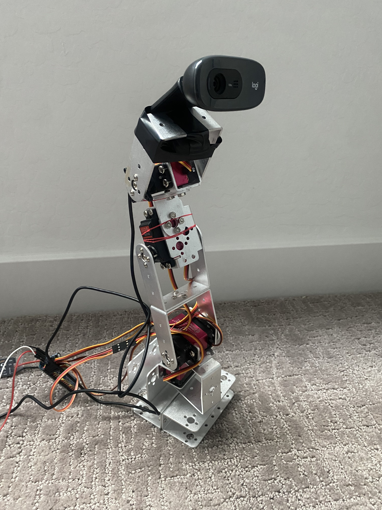
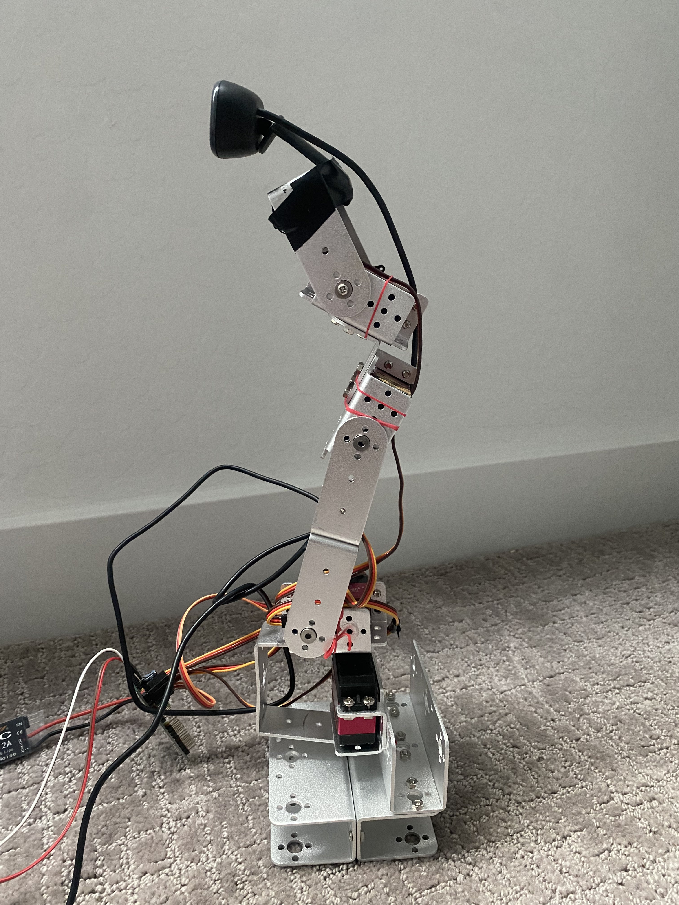
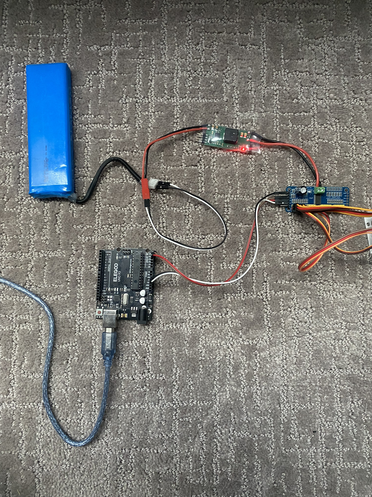

# Hardware

Photos of the assemblede hardware — 4-servo arm with camera mount and the Arduino+PCA9685+UBEC power wiring.

## Camera + servo arm

Logitech C270 webcam mounted at the top of the arm, driven by a stack of DS3218 servos (base, shoulder, elbow, wrist). See [`project-database.md`](project-database.md#31-servo-calibration-final-values) for per-servo PWM calibration values.

## Control + power wiring

Arduino Uno (USB-connected to laptop) driving a PCA9685 servo driver over I2C, powered by a UBEC off a LiPo battery. Servo power and Arduino ground are wiredvi together — see [`system-schematic.md`](system-schematic.md#physical-wiring-notes) 
