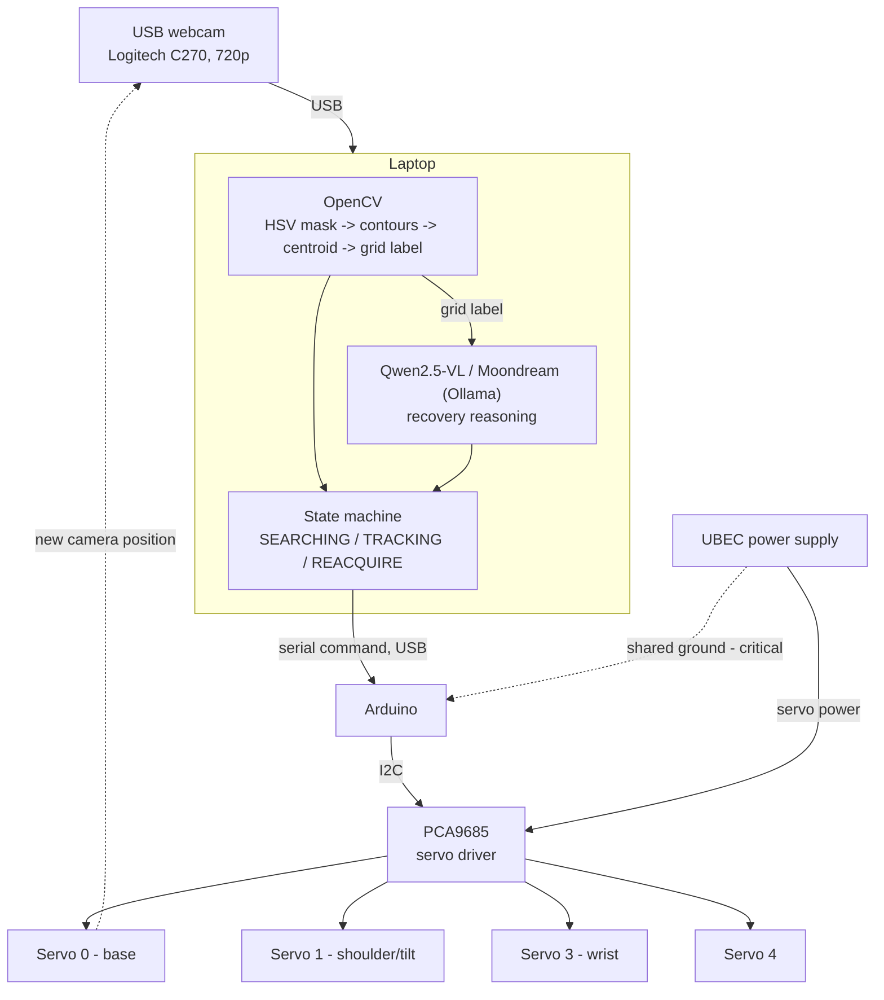

# System Schematic (Assignment 6a)

Every component and how they connect, plus the data flow from image capture through servo movement.

## Data flow (per cycle)

1. Webcam captures a frame.
2. OpenCV processes the frame: HSV color mask → cleanup → contour detection → filter by area → centroid → 3×3 grid label (in `code/detection.py`).
3.  machine applies a direct proportional correction using the centroid — no VLM call don.
4. If tracking is lost (occlusion, lighting change, unrecognized object), the grid label and task context are sent to the VLM, which returns one action from the fixed vocabulary (`ROTATE_BASE_LEFT_15`, `TILT_UP_10`, `CONFIRM_TARGET`, etc.).
5. The chosen action is sent to the Arduino over USB serial.
6. The Arduino drives the PCA9685 over I2C, which sets PWM output to the appropriate servo(s).
7. The servo moves, repositioning the camera; a new frame is captured and the cycle repeats.

## Physical wiring notes

-  UBEC ground must be tied to Arduino ground, or servo signals become meaningless (see `docs/project-database.md`, section 3).
- Servo power comes from the UBEC, never directly from the Arduino's 5V pin — three DS3218 servos can spike to ~9A combined under load, well past what the Arduino can source.
- See `docs/project-database.md` section 3.1 for per-servo PWM calibration values (min/center/max).
